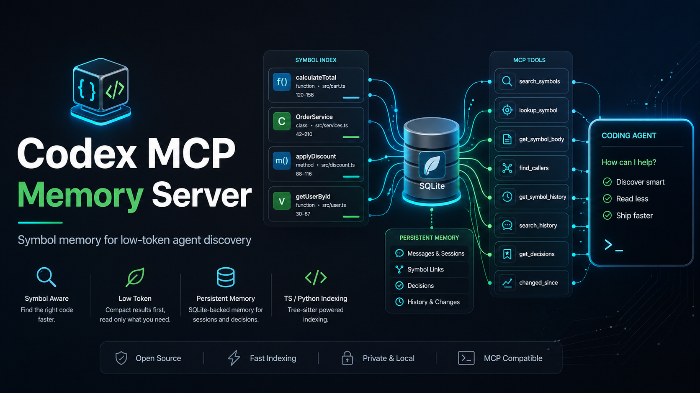
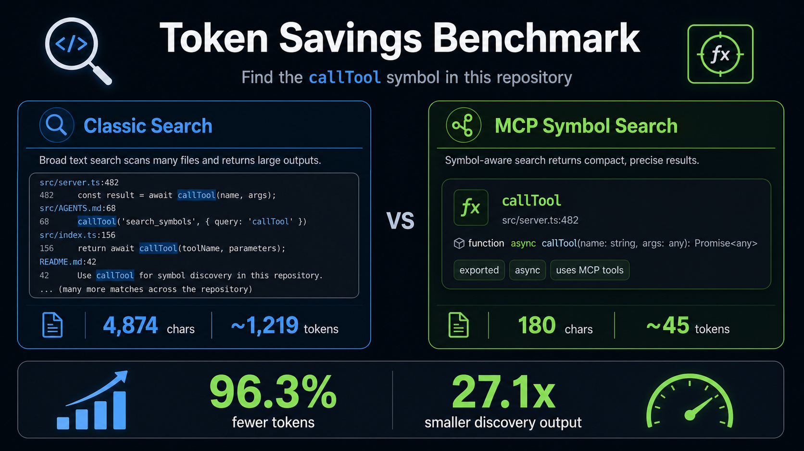

# Codex MCP Memory Server

Symbol-aware MCP memory server for Codex and coding agents.

It indexes TypeScript, TSX, JavaScript, JSX, and Python projects with tree-sitter, stores symbol metadata in SQLite, and exposes compact MCP tools for low-token project discovery.

## Why

Agents often spend a lot of tokens finding the right file or function before reading the code that matters. This server makes the first pass cheaper:

1. Search compact symbol metadata.
2. Pick the relevant symbol by `ref`, file, and line range.
3. Read the full symbol body only when needed.
4. Save durable messages and decisions for future agents.

## Measured Token Savings



Current benchmark task: find the `callTool` symbol in this repository.

```text
classic_tokens=1794
mcp_tokens=45
savings=97.5%
smaller_output=39.9x
```

Token counts are practical estimates based on `characters / 4`; the important point is the relative size difference during the discovery phase.

See [docs/benchmarks.md](docs/benchmarks.md) for benchmark scope and output files.

## Quick Start

```powershell
codex mcp add codex-mcp-memory-server `
  --env PROJECT_PATH="C:\path\to\your\repo" `
  --env PROJECT_ID="your-project-id" `
  --env MCP_MEMORY_DB_PATH="C:\Users\you\.mcp-memory-server\memory.db" `
  -- npx -y codex-mcp-memory-server
```

Minimal form:

```powershell
codex mcp add codex-mcp-memory-server -- npx -y codex-mcp-memory-server
```

See [docs/quickstart.md](docs/quickstart.md) for NPX usage, environment variables, and verification.

## Tools

Discovery tools return compact results by default.

Core tools:

- `index_status`
- `search_symbols`
- `lookup_symbol`
- `get_symbol_body`
- `find_callers`
- `reindex_changed_files`
- `reconcile_index`
- `changed_symbols_risk`
- `save_message`
- `search_history`
- `save_decision`
- `get_decisions`

See [docs/tools.md](docs/tools.md) for the full tool list.

## Recommended Agent Flow

1. Start with `index_status`, `search_symbols`, `lookup_symbol`, `search_history`, or `get_decisions`.
2. Use compact output to identify a symbol, file, and line range.
3. Call `get_symbol_body` only for selected symbols.
4. Use shell search/read commands for docs, config, CSS, JSON, fixtures, and broad non-symbol searches.
5. Save important project decisions with `save_decision`.

See [docs/agent-flows.md](docs/agent-flows.md) and [AGENTS.md](AGENTS.md) for task-specific flows.

## Documentation

- [Quickstart](docs/quickstart.md)
- [Tools](docs/tools.md)
- [Benchmarks](docs/benchmarks.md)
- [Agent Flows](docs/agent-flows.md)
- [Architecture](docs/architecture.md)
- [Troubleshooting](docs/troubleshooting.md)
- [Demo Transcript](docs/demo.md)
- [Plugin Polish](docs/plugin.md)
- [Roadmap](docs/ROADMAP.md)

## Local Development

```powershell
npm install
npm test
npm run build
```

Run from source:

```powershell
$env:PROJECT_PATH="C:\path\to\your\repo"
$env:PROJECT_ID="your-project-id"
npm start
```

Run benchmarks:

```powershell
npm run benchmark
```

## Publishing

```powershell
npm test
npm pack --dry-run
npm publish --access public
```

`prepack` builds `dist/src`, and `prepublishOnly` runs the full test suite.

## Notes

- This is a symbol memory/indexing server, not a replacement for source inspection.
- Compact outputs intentionally omit full code bodies to reduce token use during discovery.
- Full source remains available through `get_symbol_body`.
- `find_callers` returns AST definite callers and fuzzy probable callers.
